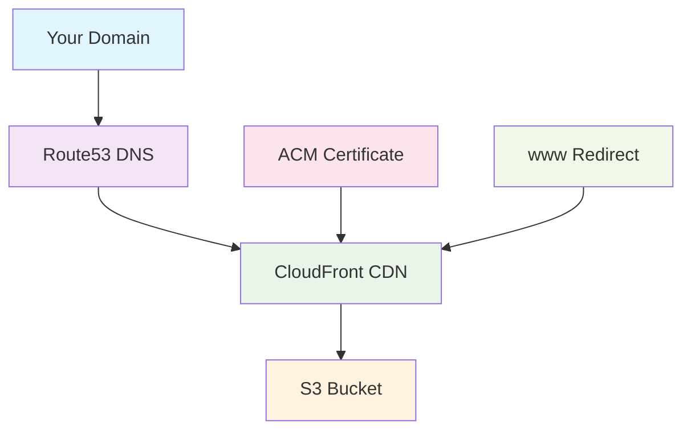

# AWS Website Quick Deployer

> **Automate static website hosting on AWS in under 5 minutes**

[](https://opensource.org/licenses/MIT)
[](https://aws.amazon.com/cloudformation/)
[](https://www.gnu.org/software/bash/)

Deploy production-ready static websites on AWS with Route53, S3, CloudFront, and free SSL certificates. One command replaces 30+ minutes of manual AWS console clicking.

## ✨ Features

- 🚀 **5-minute deployment** - From zero to live website
- 🔒 **Free SSL certificates** - Automatic HTTPS with AWS Certificate Manager
- 🌍 **Global CDN** - CloudFront for worldwide fast loading
- 📱 **Mobile optimized** - Responsive DNS and caching
- 🛡️ **Security hardened** - Private S3 buckets with CloudFront-only access
- 🔄 **Easy updates** - Update content without touching infrastructure
- 💰 **Cost effective** - Typically $1-5/month for small sites
- 🧹 **Simple cleanup** - Remove everything with one command

## 🎯 Quick Start

### Prerequisites

- AWS CLI installed
- `jq` command-line tool
- AWS credentials (environment variables or `aws configure`)

### Installation

```bash
git clone https://github.com/Akramovic1/aws-website-quick-deployer.git
cd aws-website-quick-deployer
chmod +x *.sh
```

### Deploy Your First Website

```bash
# Infrastructure only (recommended)
./deploy-website.sh example.com

# Or infrastructure + upload files
./deploy-website.sh example.com ./my-website
```

### Add Name Servers to Your Domain

The script outputs name servers like:

```
📋 NAME SERVERS (Add these to your domain registrar):
   1. ns-1234.awsdns-56.org
   2. ns-5678.awsdns-90.net
   3. ns-9012.awsdns-34.co.uk
   4. ns-3456.awsdns-78.com
```

Copy these to your domain registrar (GoDaddy, Namecheap, etc.) and wait 24-48 hours for DNS propagation.

## 🏗️ What Gets Created



## 📋 Usage Examples

### Infrastructure-Only Deployment (Recommended)

```bash
# Deploy AWS infrastructure
./deploy-website.sh mysite.com

# Upload files when ready
aws s3 sync ./website s3://mysite.com

# Update files anytime
aws s3 sync ./updated-website s3://mysite.com --delete
```

### All-in-One Deployment

```bash
# Deploy infrastructure and upload files together
./deploy-website.sh mysite.com ./website-folder
```

### Multiple Websites

```bash
# Deploy multiple sites easily
./deploy-website.sh site1.com ./websites/site1
./deploy-website.sh site2.com ./websites/site2
./deploy-website.sh blog.example.com ./websites/blog
```

### Cleanup

```bash
# Remove all AWS resources for a domain
./cleanup-website.sh mysite.com
```

## 🔑 AWS Credentials

The scripts auto-detect credentials in this order:

1. **Environment variables** (priority)
2. **AWS CLI configuration** (fallback)
3. **Error** if neither exists

### Method 1: Environment Variables (Recommended for CI/CD)

```bash
export AWS_ACCESS_KEY_ID='AKIAI...'
export AWS_SECRET_ACCESS_KEY='wJalrXUt...'
export AWS_REGION='us-east-1'  # optional
```

### Method 2: AWS CLI Configuration

```bash
aws configure
# Enter: Access Key, Secret Key, Region (us-east-1), Output format (json)
```

## 🗂️ Project Structure

```
aws-website-quick-deployer/
├── website-template.yaml           # CloudFormation infrastructure template
├── deploy-website.sh              # Main deployment script
├── cleanup-website.sh             # Cleanup script
├── deploy-with-credentials.sh     # Optional: Deploy with inline credentials
├── cleanup-with-credentials.sh    # Optional: Cleanup with inline credentials
├── aws-website-deployer.py        # Optional: Python version
└── websites/                      # Your website folders
    ├── my-portfolio/
    │   ├── index.html
    │   ├── style.css
    │   └── assets/
    └── my-blog/
        ├── index.html
        └── posts/
```

## 💡 Website File Examples

### Simple Static Site

```html
<!-- index.html -->
<!DOCTYPE html>
<html>
  <head>
    <title>My Website</title>
    <meta charset="UTF-8" />
    <meta name="viewport" content="width=device-width, initial-scale=1.0" />
  </head>
  <body>
    <h1>Welcome to My Website</h1>
    <p>Hosted on AWS with automated deployment!</p>
  </body>
</html>
```

### React/Vue Build Output

```
build/
├── index.html
├── static/
│   ├── css/
│   ├── js/
│   └── media/
└── manifest.json
```

## 🛠️ Advanced Usage

### Custom Domain with Subdomain

```bash
./deploy-website.sh blog.mysite.com ./blog-website
./deploy-website.sh app.mysite.com ./app-build
```

### Multiple AWS Accounts

```bash
# Account 1
export AWS_ACCESS_KEY_ID='account1-key'
./deploy-website.sh site1.com

# Account 2
export AWS_ACCESS_KEY_ID='account2-key'
./deploy-website.sh site2.com
```

### Update Infrastructure

```bash
# Modify website-template.yaml then run:
./deploy-website.sh existing-site.com
```

### Manual File Upload

```bash
# Upload specific files
aws s3 cp ./new-page.html s3://mysite.com/

# Sync entire directory
aws s3 sync ./website s3://mysite.com --delete

# Invalidate CDN cache for immediate updates
aws cloudfront create-invalidation --distribution-id E1A2B3C4D5 --paths "/*"
```

## 💰 Cost Breakdown

Typical monthly costs for a small website:

| Service             | Cost                             | Description          |
| ------------------- | -------------------------------- | -------------------- |
| Route53 Hosted Zone | $0.50                            | DNS management       |
| CloudFront          | $0.085/GB + $0.0075/10k requests | Global CDN           |
| S3 Storage          | $0.023/GB                        | File storage         |
| ACM Certificate     | Free                             | SSL/TLS certificate  |
| **Total**           | **$1-5/month**                   | For most small sites |

## 🐛 Troubleshooting

### Common Issues

**"No valid AWS credentials found"**

```bash
# Test credentials
aws sts get-caller-identity

# Set environment variables
export AWS_ACCESS_KEY_ID='your-key'
export AWS_SECRET_ACCESS_KEY='your-secret'
```

**"Certificate validation failed"**

```bash
# Check DNS records were created in Route53
aws route53 list-resource-record-sets --hosted-zone-id YOUR_ZONE_ID

# Wait up to 30 minutes for validation
```

**Website not loading**

```bash
# Check DNS propagation
nslookup mysite.com
dig mysite.com

# Verify CloudFront distribution
aws cloudfront list-distributions
```

### Debug Commands

```bash
# Check stack status
aws cloudformation describe-stacks --stack-name website-mysite-com

# List S3 bucket contents
aws s3 ls s3://mysite.com --recursive

# Check CloudFront distributions
aws cloudfront list-distributions --query 'DistributionList.Items[].{Domain:DomainName,Aliases:Aliases.Items}'
```

## 🔧 Prerequisites Installation

### Ubuntu/Debian

```bash
# AWS CLI
curl "https://awscli.amazonaws.com/awscli-exe-linux-x86_64.zip" -o "awscliv2.zip"
unzip awscliv2.zip && sudo ./aws/install

# jq
sudo apt-get install jq
```

### macOS

```bash
# AWS CLI
brew install awscli

# jq
brew install jq
```

### Windows (WSL)

```bash
# Use Windows Subsystem for Linux with Ubuntu
# Then follow Ubuntu instructions
```

## 🤝 Contributing

Contributions are welcome! Please feel free to submit a Pull Request. For major changes, please open an issue first to discuss what you would like to change.

### Development Setup

```bash
git clone https://github.com/Akramovic1/aws-website-quick-deployer.git
cd aws-website-quick-deployer

# Test the scripts
./deploy-website.sh test-site.com
./cleanup-website.sh test-site.com
```

## 📄 License

This project is licensed under the MIT License - see the [LICENSE](LICENSE) file for details.

## ⭐ Star History

[](https://star-history.com/Akramovic1/aws-website-quick-deployer&Date)

## 🙏 Acknowledgments

- Built with AWS CloudFormation for reliable infrastructure
- Inspired by the need for simple, automated website deployment
- Thanks to the AWS community for best practices and examples

---

<div align="center">

**[⬆ Back to Top](#aws-website-quick-deployer)**

Made with ❤️ for developers who want to focus on building, not configuring.

</div>
